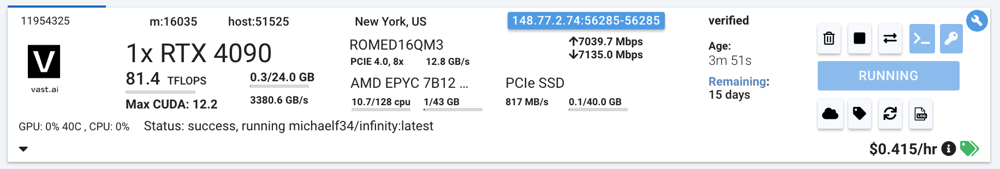

Deployment via [Vast.ai](https://vast.ai)

## Local CLI:
Vast offers a nice UI to deploy instances and a command line interface. The command line interface can be installed with the python package:
```bash 
pip install --upgrade vastai
```
```bash
vastai search offers 'compute_cap > 800 gpu_ram > 20 num_gpus = 1 static_ip=true direct_port_count > 1' 
# Select the instance and paste it in for <instance-id> to launch
# Single embedding model deployment:
vastai create instance <instance-id> --image michaelf34/infinity:latest --env '-p 8000:8000' --disk 40 --args v2 --model-id michaelfeil/bge-small-en-v1.5 --port 8000 --api-key simple_key
# Multiple models:
vastai create instance <instance-id> --image michaelf34/infinity:latest --env '-p 8000:8000' --disk 40 --args v2 --model-id mixedbread-ai/mxbai-rerank-xsmall-v1 --model-id  SamLowe/roberta-base-go_emotions --port 8000
```

## Finding your IP Address:
Once your instance is up, the ports will be ready. In the Vast UI, you will see a blue button with an IP address and port range: 

In the view that pops up, you'll see something like: 

```
Open Ports
XX.XX.XXX.XX:YYYY ->  8000/tcp
```
Now for all of our URLs for server calls, we will use these ports. So a potential call to our instance might look like:
``` python
from openai import OpenAI

# Modify OpenAI's API key and API base to use Infinity's API server.
openai_api_key = "simple_key"
openai_api_base = "http://<Instance-IP-Address>:<Port>"
client = OpenAI(
    api_key=openai_api_key,
    base_url=openai_api_base,
)
model = "michaelfeil/bge-small-en-v1.5"
embeddings = client.embeddings.create(model=model, input="What is Deep Learning?").data[0].embedding
print("Embeddings:")
print(embeddings)
```
